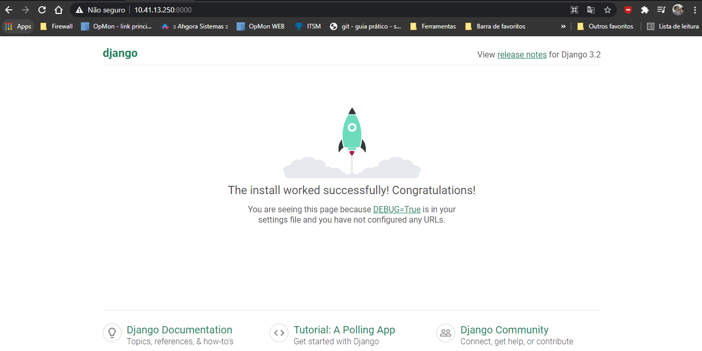

# Configuração Inicial - Projeto Django / Postgresql

Projeto que automatiza a criação de um ambiente DEV. 
Disponibiliza uma imagem docker do postgres com as variáveis de ambiente necessárias para a configuração do banco na aplicação.
Cria uma imagem python3 apontando o diretório de trabalho para o container e instala todas as dependências descritas no arquivo [requirements.txt](requirements.txt)


## Requisitos

Requisitos necessários para rodar.

- Python 3
- Docker
- Docker Compose

## Instalação 

Instalando o Python3 no CentOS

```
yum update -y
yum install -y python3
```

Instalando e iniciando o docker

```
sudo yum install -y yum-utils
sudo yum install -y docker
sudo systemctl start docker
```

Instalando o docker compose

```
sudo curl -L "https://github.com/docker/compose/releases/download/1.29.1/docker-compose-$(uname -s)-$(uname -m)" -o /usr/local/bin/docker-compose
sudo mv /usr/local/bin/docker-compose /usr/bin/docker-compose
sudo chmod +x /usr/bin/docker-compose
docker-compose --version
```


## Clonando o repositório

Crie um novo diretório e faça um clone deste repositório

```
git clone git@github.com:lportinari/django_docker.git
```

# Como executar 

Após ter instalado todos os pré-requisitos e clonado o repositório, é hora de executar:
Acesse a pasta raiz do projeto (mesma pasta de onde está localizado o arquivo docker-compose)

Subir o ambiente com o docker-compose e configurar um novo projeto django

```
sudo docker-compose run web django-admin startproject 'nome-do-projeto-django' .
```

Após o build, vamos configurar o banco de dados na aplicação.
No diretório do projeto, modifique o arquivo nome-do-projeto-django/settings.py para o mesmo valor das variáveis do db environments no arquivo [docker-compose.yml](docker-compose.yml)
Sobrescreva o DATABASE = para:

```
DATABASES = {
    'default': {
        'ENGINE': 'django.db.backends.postgresql',
        'NAME': 'dbname',
        'USER': 'dbuser',
        'PASSWORD': 'dbpass',
        'HOST': 'db',
        'PORT': 5432,
    }
}
```

Subindo o projeto:

```
docker-compose up -d
```

Se tudo ocorrer bem, você verá esta página:



